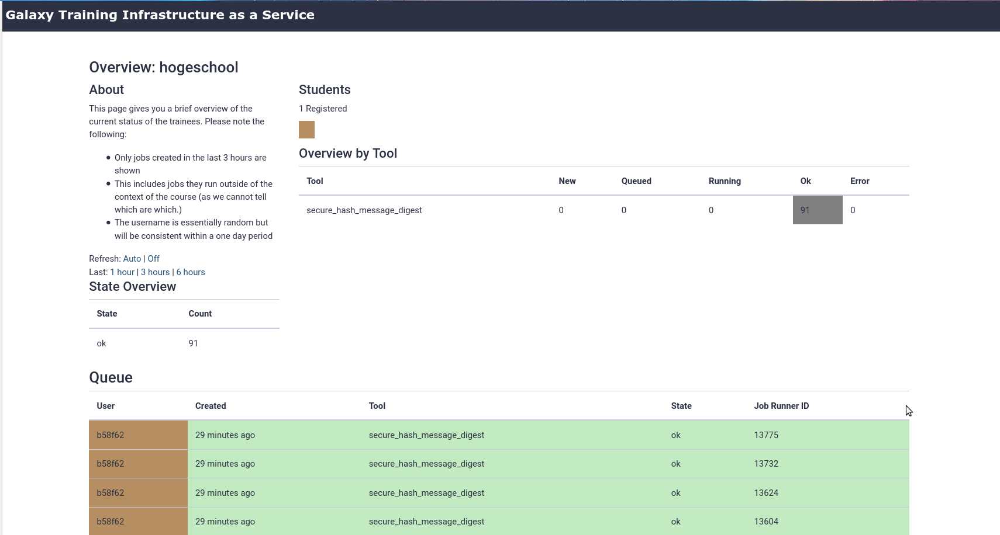
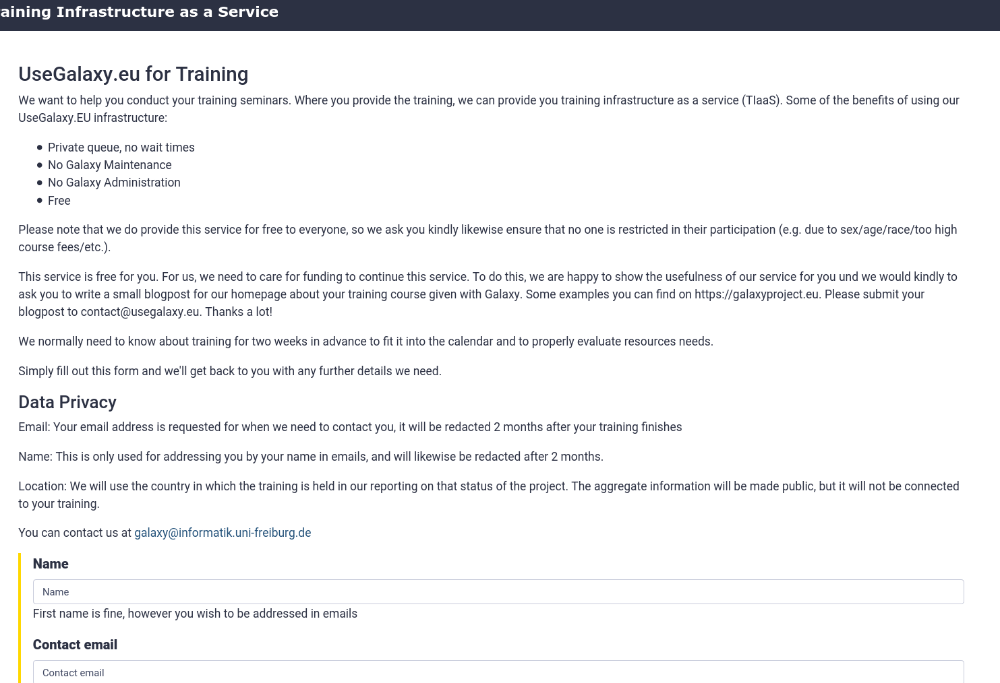
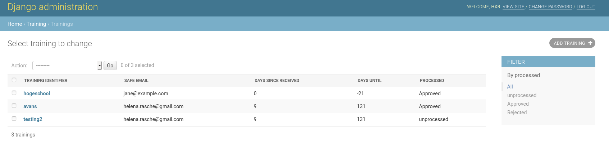

# Training Infrastructure as a Service 2

The latest and greatest TIaaS from Galaxy Europe!

This should be easier than ever to setup and get started with at your own institution.

This is a simple service which allows users visiting a specific URL like:

```
https://usegalaxy.eu/join-training/denbi-summer-school
```

to be automatically added to a group named `training-denbi-summer-school` (and
a role automatically created.) It works on the basis of running underneath the
path prefix of Galaxy and so having access to the Galaxy session cookie. This
is decoded into a user id + the part after `/join-training/` decoded into a
group name, and this change is made.

## New! Status Page

For teachers giving trainings, we now offer a "status" page where they can see
the training queue of their class, both jobs and workflows.



## New! Register

Point your users to this service to register their training



## New! Admin Interface

Admins can now manage TIaaS courses completely in the one service.



## License

AGPL-3.0
